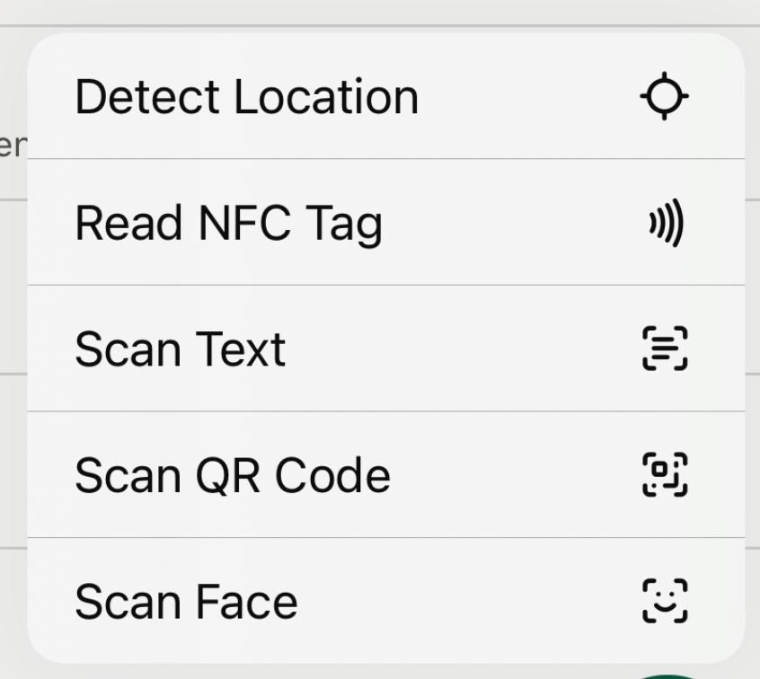
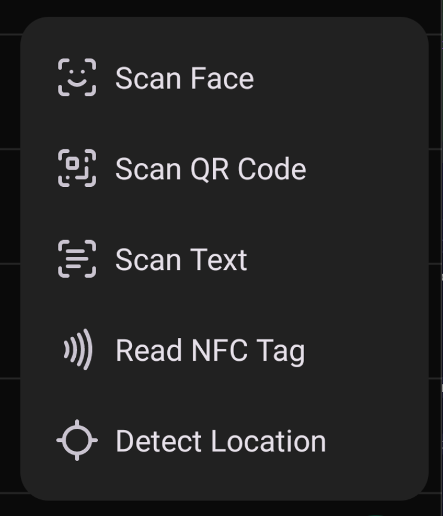

# react-native-icon-converter

A command-line tool to convert SVG icons into formats compatible with both Android and iOS from a single source. Also has an expo plugin to copy the files into the correct native folders.

## Installation

```bash
npm install react-native-icon-converter --save-dev
```

## Expo Integration

Add the plugin to your Expo config in `app.json` or `app.config.js`:

```json
{
  "expo": {
    "plugins": ["react-native-icon-converter"]
  }
}
```

With custom paths (optional):

```json
{
  "expo": {
    "plugins": [
      [
        "react-native-icon-converter",
        {
          "ios": "./assets/ios-icons/Icons.xcassets",
          "android": "./assets/android-icons"
        }
      ]
    ]
  }
}
```

## Example use case with native menu

### iOS Icons



### Android Icons


